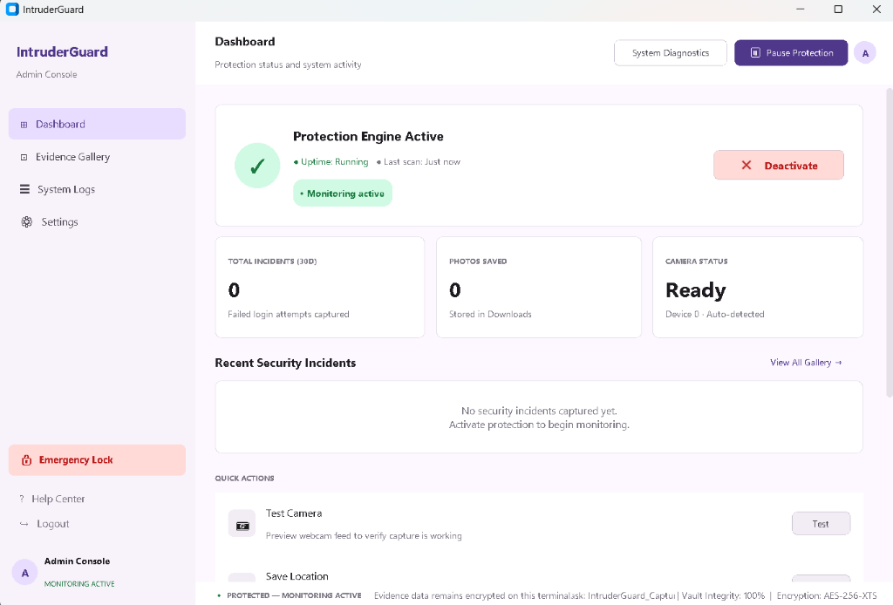
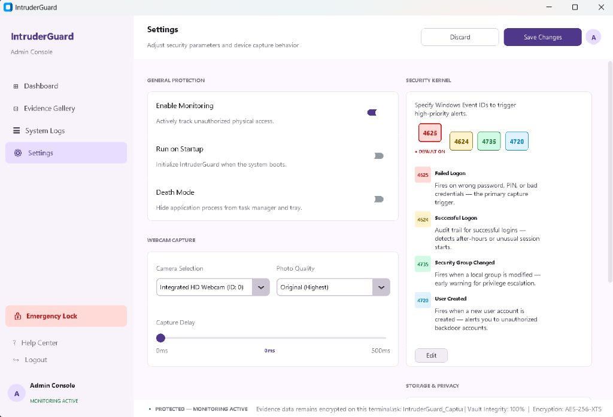
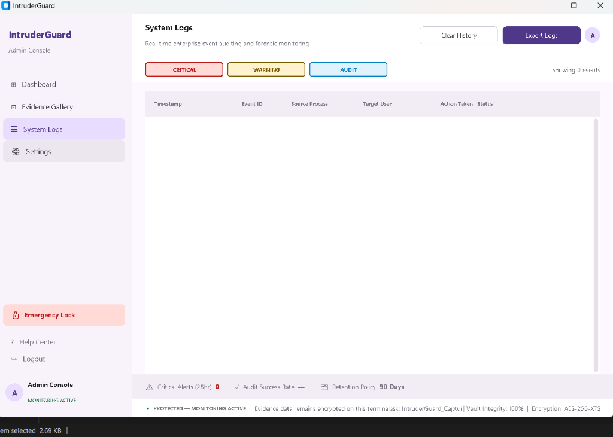
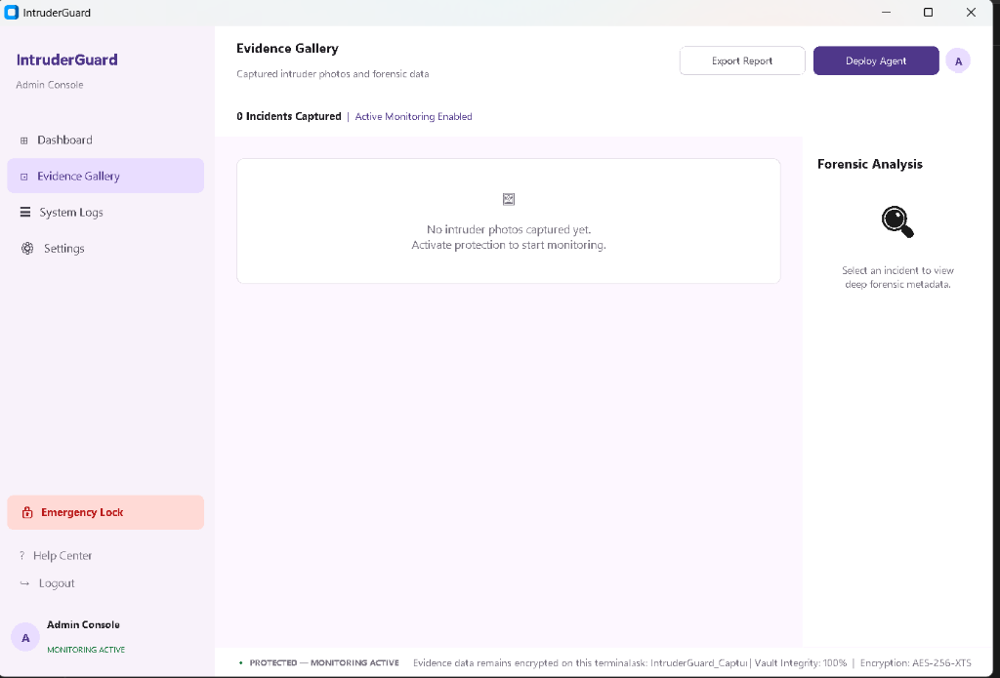

<div align="center">
  <br />
  <h1>🛡️ INTRUDERGUARD</h1>
  <h3>The Ghost in the Kernel</h3>
  <br />
  <p>
    <strong>Automatic physical security and Event Log auditing for Windows.</strong>
  </p>
</div>

---

IntruderGuard is a high-performance system security utility that hooks directly into the Windows Security Kernel. It monitors critical Windows Security Event IDs (such as logon failures and unauthorized account creations) and instantly triggers webcam captures to document intruders—running silently, instantly, and persistently in the background.

## ✨ Features & Architecture

*   **🎨 Premium Security Console**: Built on a modern Material Design 3 theme utilizing CustomTkinter, featuring responsive status cards, real-time activity charts, and smooth UI animations.
*   **⚙️ Advanced Security Kernel**:
    *   Monitor multiple Windows Security Event IDs:
        *   `4625` (Failed Logon) — **DEFAULT ON** (Visual highlighting & visual card border).
        *   `4624` (Successful Logon) — For audit trails.
        *   `4735` (Security Group Modification) — For privilege escalation alerts.
        *   `4720` (User Account Created) — Detects unauthorized backdoors.
        *   `4647` (User-Initiated Logoff) — Monitors session exit events.
        *   `4648` (Explicit Credential Logon) — Detects lateral movement attempts.
    *   Dynamic **Edit Dialog** featuring modal switches, description tags, and live Task Scheduler XML configuration updates.
*   **📷 Lock-Screen Webcam Capture (SYSTEM Context)**:
    *   Runs as a background `pythonw.exe` task under local `SYSTEM` privileges.
    *   Allows webcam access even when the Windows screen is locked and no user session is active.
*   **🔒 Encrypted Forensic Gallery (Evidence Vault)**:
    *   Enforces custom file retention policies (auto-purge older photos after 7, 30, or 90 days).
    *   Secure storage permissions to prevent unauthorized deletion.
*   **🛠️ System Diagnostics & Logs Exporter**:
    *   Verify webcam detection, Logon Auditing state, Scheduled Task registration, and file system permissions with one click.
    *   Export comprehensive forensic reports and raw system audit logs.
---

## 📸 App Interface

Here is a preview of the IntruderGuard Console interface:

| 🖥️ Dashboard | ⚙️ Settings |
|:---:|:---:|
|  |  |
| **🔍 System Logs** | **📁 Evidence Gallery** |
|  |  |

---

## 🚀 One-Click Setup (Quick Start)

The installation process is automated. **No manual library installs or complex command-line configuration required.**

1.  **Download & Extract**
    *   Extract the ZIP folder containing the project files to a secure location on your PC.
2.  **Run the Installer**
    *   Locate the file named **`Setup_Python.bat`**.
    *   **Right-click it** and select **"Run as Administrator"**.
    *   *The installer will automatically detect Python, install dependency libraries, register the background worker, and launch the console.*
3.  **Activate & Test**
    *   Click **"ACTIVATE PROTECTION"** in the console.
    *   Lock your computer (**Win + L**) and enter an incorrect password.
    *   Log back in and open the **Evidence Vault** to view the snapshot!

---

## 🔍 HOW TO CHECK IF IT IS RUNNING

You can easily verify that IntruderGuard is actively monitoring your system for threats using any of these methods:

### 1. Via the GUI Dashboard
*   Launch the app (`intruder_guard.py` or run `Setup_Python.bat`). 
*   The main dashboard status will show a green checkmark stating **"Protection Engine Active"**.
*   The status bar at the very bottom will read **`PROTECTED — MONITORING ACTIVE`** and display the background worker **`Task: IntruderGuard_Capture`**.

### 2. Via Windows Task Scheduler
*   Open PowerShell and run the following query:
    ```powershell
    schtasks /query /tn IntruderGuard_Capture
    ```
*   If running properly, this command will print status details (e.g., `Status: Ready`). If it is not running, it will return a system error stating the task doesn't exist.

### 3. Via Event Auditing Policy
*   Open PowerShell as **Administrator** and run:
    ```powershell
    auditpol /get /subcategory:Logon
    ```
*   Under the "Logon" subcategory, it should report that **`Failure`** or **`Success and Failure`** auditing is currently enabled.

---

## 🧼 HOW TO COMPLETELY TURN OFF & DELETE

If you need to disable IntruderGuard temporarily or wipe it entirely from your system, follow the instructions below.

### Phase A: Simple Turn Off (Deactivate)
To immediately pause monitoring without deleting any files or evidence:
1.  Launch the IntruderGuard GUI.
2.  Click the prominent red **"DEACTIVATE"** button on the main dashboard, or toggle **"Enable Monitoring"** off in the Settings tab and click **"Save Changes"**.
3.  *Result*: This immediately unregisters the background task and disables the strict security auditing policies. No further captures will occur.

### Phase B: Complete Deletion (Uninstall)
To completely remove all traces of IntruderGuard from your machine:

1. **Unregister Core Services**:
   Open PowerShell as **Administrator** and execute the following commands to forcefully remove the hooks and policies:
   ```powershell
   # Force delete the background monitoring task
   schtasks /delete /tn IntruderGuard_Capture /f

   # Restore default Windows auditing behavior (disable logging)
   auditpol /set /subcategory:"Logon" /failure:disable
   auditpol /set /subcategory:"Credential Validation" /failure:disable

   # Remove the startup registry key (if it was enabled)
   Remove-ItemProperty -Path "HKCU:\Software\Microsoft\Windows\CurrentVersion\Run" -Name "IntruderGuard" -ErrorAction SilentlyContinue
   ```

2. **Wipe Local Program Data**:
   *   Press `Win + R` on your keyboard, type `C:\ProgramData`, and hit Enter.
   *   Locate the **`IntruderGuard`** folder. 
   *   **Delete this entire folder.** This will permanently destroy all captured forensic logs, configuration caches, and background worker scripts.

3. **Delete Source Directory**:
   *   Finally, delete the project folder you initially downloaded and extracted (for example, `Downloads\Intruder-Guard-main` or `D:\Intruder-Guard-main`).

---

## 🔬 Under the Hood (Architecture)

### Kernel Hooking
Instead of running a heavy, battery-draining background loop, IntruderGuard hooks directly into the **Windows Event Log**. When the Windows Security channel registers a specified Event ID, the Windows Task Scheduler immediately fires the background trigger. This guarantees **0% CPU usage** while idle.

### SYSTEM Service Execution
Windows restricts webcam access under standard locked-session user accounts. To bypass this, the Scheduled Task executes a batch wrapper pointing to the local `SYSTEM` account, granting raw hardware control access even when the PC is locked.

---

## ⚠️ Disclaimer
This utility is intended for personal computer security and educational research. Please consult local privacy and surveillance laws prior to deployment. Data is 100% offline and stays on your machine.

*© 2026 IntruderGuard | Enterprise Security Utility*
